# Design Técnico - Straxis SaaS B2B

**Data de Criação:** 26/01/2026  
**Desenvolvedores:** Kaynan e Renier  
**Versão:** 1.1

---

## 🆕 Changelog v1.1

**Melhorias Críticas de Segurança e Operação:**

1. **Soft Delete**: Implementado `deletedAt` para preservar histórico financeiro
2. **Valores em Centavos**: Padrão bancário (integer) para prevenir fraudes
3. **Rate Limiting**: Controle de uso WhatsApp e IA
4. **Fallback Operacional**: Estratégia de recuperação para falhas
5. **Resolução de Conflitos**: Política para sincronização offline

---

## Overview

O Straxis é um sistema SaaS B2B multi-tenant para gestão de operações de carga e descarga. A arquitetura é baseada em Firebase (Firestore, Auth, Storage) com frontend React/TypeScript PWA mobile-first e backend Node.js. O sistema integra WhatsApp via Baileys e oferece assistente de IA opcional (OpenAI/Gemini) com controle rigoroso de custos e prevenção de alucinações.

### Princípios Arquiteturais

1. **Multi-tenant com isolamento total**: Cada empresa é um tenant isolado no Firestore
2. **Mobile-first**: Interface otimizada para dispositivos móveis
3. **Offline-first**: PWA com cache local e sincronização
4. **IA controlada**: Apenas consulta dados reais do Firestore, sem invenção
5. **Logs completos**: Auditoria de todas as ações críticas
6. **Modular**: Componentes independentes e reutilizáveis
7. **Design System Consistente**: UI/UX profissional com componentes reutilizáveis
8. **Acessibilidade**: WCAG 2.1 AA compliance

---

## Design System

### Bibliotecas e Ferramentas

**UI Components:**
- **Shadcn/ui** ou **Radix UI**: Componentes acessíveis e customizáveis
- **Headless UI**: Componentes sem estilo para máxima flexibilidade

**Ícones:**
- **Lucide React**: Biblioteca moderna com 1000+ ícones SVG
- Alternativa: **Heroicons** ou **Phosphor Icons**
- Tamanhos: 16px (small), 20px (default), 24px (large), 32px (xlarge)

**Gráficos:**
- **Recharts**: Biblioteca React para gráficos responsivos e interativos
- Alternativa: **Chart.js** com react-chartjs-2
- Tipos: Line, Bar, Area, Pie, Composed

**Animações:**
- **Framer Motion**: Animações declarativas e performáticas
- CSS Transitions: Para animações simples
- Princípio: Animações sutis (200-300ms) para não distrair

**Notificações:**
- **React Hot Toast** ou **Sonner**: Toasts modernos e customizáveis

**Formulários:**
- **React Hook Form**: Performance e validação
- **Zod**: Schema validation

### Paleta de Cores

```typescript
// Light Theme
const lightColors = {
  // Primary - Azul profissional
  primary: {
    50: '#e3f2fd',
    100: '#bbdefb',
    200: '#90caf9',
    300: '#64b5f6',
    400: '#42a5f5',
    500: '#2196f3',  // Main
    600: '#1e88e5',
    700: '#1976d2',
    800: '#1565c0',
    900: '#0d47a1',
  },
  
  // Success - Verde
  success: {
    50: '#e8f5e9',
    100: '#c8e6c9',
    500: '#4caf50',  // Main
    700: '#388e3c',
    900: '#1b5e20',
  },
  
  // Error - Vermelho
  error: {
    50: '#ffebee',
    100: '#ffcdd2',
    500: '#f44336',  // Main
    700: '#d32f2f',
    900: '#b71c1c',
  },
  
  // Warning - Laranja
  warning: {
    50: '#fff3e0',
    100: '#ffe0b2',
    500: '#ff9800',  // Main
    700: '#f57c00',
    900: '#e65100',
  },
  
  // Info - Azul claro
  info: {
    50: '#e1f5fe',
    100: '#b3e5fc',
    500: '#03a9f4',  // Main
    700: '#0288d1',
    900: '#01579b',
  },
  
  // Neutral - Cinzas
  neutral: {
    50: '#fafafa',
    100: '#f5f5f5',
    200: '#eeeeee',
    300: '#e0e0e0',
    400: '#bdbdbd',
    500: '#9e9e9e',
    600: '#757575',
    700: '#616161',
    800: '#424242',
    900: '#212121',
  },
  
  // Background
  background: {
    default: '#fafafa',
    paper: '#ffffff',
    elevated: '#ffffff',
  },
  
  // Text
  text: {
    primary: '#212121',
    secondary: '#757575',
    disabled: '#bdbdbd',
  },
};

// Dark Theme
const darkColors = {
  primary: {
    500: '#90caf9',  // Mais claro no dark
  },
  
  success: {
    500: '#66bb6a',
  },
  
  error: {
    500: '#ef5350',
  },
  
  warning: {
    500: '#ffa726',
  },
  
  info: {
    500: '#42a5f5',
  },
  
  neutral: {
    50: '#1e1e1e',
    100: '#2d2d2d',
    200: '#3d3d3d',
    300: '#4d4d4d',
    400: '#6d6d6d',
    500: '#8d8d8d',
    600: '#adadad',
    700: '#cdcdcd',
    800: '#e0e0e0',
    900: '#f5f5f5',
  },
  
  background: {
    default: '#121212',
    paper: '#1e1e1e',
    elevated: '#2d2d2d',
  },
  
  text: {
    primary: '#ffffff',
    secondary: '#b0b0b0',
    disabled: '#6d6d6d',
  },
};
```

### Tipografia

```typescript
const typography = {
  fontFamily: {
    sans: "'Inter', -apple-system, BlinkMacSystemFont, 'Segoe UI', sans-serif",
    mono: "'JetBrains Mono', 'Fira Code', monospace",
  },
  
  fontSize: {
    xs: '0.75rem',      // 12px
    sm: '0.875rem',     // 14px
    base: '1rem',       // 16px
    lg: '1.125rem',     // 18px
    xl: '1.25rem',      // 20px
    '2xl': '1.5rem',    // 24px
    '3xl': '1.875rem',  // 30px
    '4xl': '2.25rem',   // 36px
    '5xl': '3rem',      // 48px
  },
  
  fontWeight: {
    light: 300,
    normal: 400,
    medium: 500,
    semibold: 600,
    bold: 700,
    extrabold: 800,
  },
  
  lineHeight: {
    tight: 1.25,
    normal: 1.5,
    relaxed: 1.75,
  },
};
```

### Espaçamento

```typescript
const spacing = {
  0: '0',
  1: '0.25rem',   // 4px
  2: '0.5rem',    // 8px
  3: '0.75rem',   // 12px
  4: '1rem',      // 16px
  5: '1.25rem',   // 20px
  6: '1.5rem',    // 24px
  8: '2rem',      // 32px
  10: '2.5rem',   // 40px
  12: '3rem',     // 48px
  16: '4rem',     // 64px
  20: '5rem',     // 80px
  24: '6rem',     // 96px
};
```

### Sombras

```typescript
const shadows = {
  sm: '0 1px 2px 0 rgba(0, 0, 0, 0.05)',
  base: '0 1px 3px 0 rgba(0, 0, 0, 0.1), 0 1px 2px 0 rgba(0, 0, 0, 0.06)',
  md: '0 4px 6px -1px rgba(0, 0, 0, 0.1), 0 2px 4px -1px rgba(0, 0, 0, 0.06)',
  lg: '0 10px 15px -3px rgba(0, 0, 0, 0.1), 0 4px 6px -2px rgba(0, 0, 0, 0.05)',
  xl: '0 20px 25px -5px rgba(0, 0, 0, 0.1), 0 10px 10px -5px rgba(0, 0, 0, 0.04)',
  '2xl': '0 25px 50px -12px rgba(0, 0, 0, 0.25)',
  inner: 'inset 0 2px 4px 0 rgba(0, 0, 0, 0.06)',
};
```

### Border Radius

```typescript
const borderRadius = {
  none: '0',
  sm: '0.25rem',   // 4px
  base: '0.5rem',  // 8px
  md: '0.75rem',   // 12px
  lg: '1rem',      // 16px
  xl: '1.5rem',    // 24px
  '2xl': '2rem',   // 32px
  full: '9999px',
};
```

### Breakpoints

```typescript
const breakpoints = {
  xs: '320px',   // Mobile small
  sm: '640px',   // Mobile large
  md: '768px',   // Tablet
  lg: '1024px',  // Desktop
  xl: '1280px',  // Desktop large
  '2xl': '1536px', // Desktop xlarge
};
```

### Ícones por Módulo

```typescript
import {
  LayoutDashboard,    // Dashboard
  Package,            // Trabalhos
  Calendar,           // Agendamentos
  Users,              // Funcionários
  FileText,           // Relatórios
  UserCog,            // Usuários
  Building2,          // Empresas
  MessageSquare,      // WhatsApp
  Brain,              // IA
  ScrollText,         // Logs
  TrendingUp,         // Faturamento
  TrendingDown,       // Custos
  DollarSign,         // Lucro
  Truck,              // Carga
  PackageOpen,        // Descarga
  Clock,              // Tempo
  CheckCircle,        // Sucesso
  XCircle,            // Erro
  AlertCircle,        // Aviso
  Info,               // Informação
  Settings,           // Configurações
  LogOut,             // Sair
  Moon,               // Dark mode
  Sun,                // Light mode
  Menu,               // Menu mobile
  X,                  // Fechar
  ChevronRight,       // Navegação
  ChevronLeft,        // Navegação
  ChevronDown,        // Dropdown
  ChevronUp,          // Dropdown
  Search,             // Busca
  Filter,             // Filtro
  Download,           // Download
  Upload,             // Upload
  Edit,               // Editar
  Trash2,             // Deletar
  Eye,                // Visualizar
  EyeOff,             // Ocultar
  Plus,               // Adicionar
  Minus,              // Remover
  Save,               // Salvar
  RefreshCw,          // Atualizar
  BarChart3,          // Gráfico de barras
  LineChart,          // Gráfico de linha
  PieChart,           // Gráfico de pizza
  Activity,           // Atividade
  Zap,                // Rápido/Energia
  Shield,             // Segurança
  Lock,               // Bloqueado
  Unlock,             // Desbloqueado
  Bell,               // Notificação
  BellOff,            // Sem notificação
  Mail,               // Email
  Phone,              // Telefone
  MapPin,             // Localização
  Home,               // Início
  ArrowRight,         // Seta direita
  ArrowLeft,          // Seta esquerda
  ArrowUp,            // Seta cima
  ArrowDown,          // Seta baixo
  ExternalLink,       // Link externo
  Copy,               // Copiar
  Check,              // Check
  Loader2,            // Loading
} from 'lucide-react';
```

### Componentes de UI

**Cards:**
```tsx
// Card com hover effect e ícone
<Card className="hover:shadow-lg transition-shadow duration-300">
  <CardHeader>
    <div className="flex items-center gap-3">
      <div className="p-2 bg-primary-100 rounded-lg">
        <TrendingUp className="w-6 h-6 text-primary-600" />
      </div>
      <CardTitle>Faturamento</CardTitle>
    </div>
  </CardHeader>
  <CardContent>
    <p className="text-3xl font-bold">R$ 125.450,00</p>
    <p className="text-sm text-neutral-600 flex items-center gap-1">
      <ArrowUp className="w-4 h-4 text-success-500" />
      <span className="text-success-500">+12.5%</span> vs mês anterior
    </p>
  </CardContent>
</Card>
```

**Buttons:**
```tsx
// Primary button com ícone
<Button variant="primary" size="md">
  <Plus className="w-4 h-4 mr-2" />
  Novo Trabalho
</Button>

// Variants: primary, secondary, outline, ghost, danger
// Sizes: sm, md, lg
```

**Badges:**
```tsx
// Status badge
<Badge variant="success">
  <CheckCircle className="w-3 h-3 mr-1" />
  Confirmado
</Badge>

// Variants: success, error, warning, info, neutral
```

**Toasts:**
```tsx
// Success toast
toast.success('Trabalho criado com sucesso!', {
  icon: <CheckCircle className="w-5 h-5" />,
  duration: 3000,
});

// Error toast
toast.error('Erro ao salvar trabalho', {
  icon: <XCircle className="w-5 h-5" />,
  duration: 4000,
});
```

### Gráficos Interativos

**Gráfico de Linha (Faturamento Mensal):**
```tsx
import { LineChart, Line, XAxis, YAxis, CartesianGrid, Tooltip, Legend, ResponsiveContainer } from 'recharts';

<ResponsiveContainer width="100%" height={300}>
  <LineChart data={data}>
    <CartesianGrid strokeDasharray="3 3" stroke="#e0e0e0" />
    <XAxis dataKey="month" stroke="#757575" />
    <YAxis stroke="#757575" />
    <Tooltip 
      contentStyle={{ 
        backgroundColor: '#ffffff', 
        border: '1px solid #e0e0e0',
        borderRadius: '8px',
        boxShadow: '0 4px 6px rgba(0,0,0,0.1)'
      }}
      formatter={(value) => formatCurrency(value)}
    />
    <Legend />
    <Line 
      type="monotone" 
      dataKey="faturamento" 
      stroke="#2196f3" 
      strokeWidth={2}
      dot={{ fill: '#2196f3', r: 4 }}
      activeDot={{ r: 6 }}
    />
    <Line 
      type="monotone" 
      dataKey="custos" 
      stroke="#f44336" 
      strokeWidth={2}
      dot={{ fill: '#f44336', r: 4 }}
    />
    <Line 
      type="monotone" 
      dataKey="lucro" 
      stroke="#4caf50" 
      strokeWidth={2}
      dot={{ fill: '#4caf50', r: 4 }}
    />
  </LineChart>
</ResponsiveContainer>
```

**Gráfico de Barras (Trabalhos por Tipo):**
```tsx
import { BarChart, Bar, XAxis, YAxis, CartesianGrid, Tooltip, Legend, ResponsiveContainer } from 'recharts';

<ResponsiveContainer width="100%" height={300}>
  <BarChart data={data}>
    <CartesianGrid strokeDasharray="3 3" />
    <XAxis dataKey="tipo" />
    <YAxis />
    <Tooltip />
    <Legend />
    <Bar dataKey="quantidade" fill="#2196f3" radius={[8, 8, 0, 0]} />
  </BarChart>
</ResponsiveContainer>
```

**Gráfico de Pizza (Distribuição de Custos):**
```tsx
import { PieChart, Pie, Cell, Tooltip, Legend, ResponsiveContainer } from 'recharts';

const COLORS = ['#2196f3', '#4caf50', '#ff9800', '#f44336', '#9c27b0'];

<ResponsiveContainer width="100%" height={300}>
  <PieChart>
    <Pie
      data={data}
      cx="50%"
      cy="50%"
      labelLine={false}
      label={renderCustomizedLabel}
      outerRadius={80}
      fill="#8884d8"
      dataKey="value"
    >
      {data.map((entry, index) => (
        <Cell key={`cell-${index}`} fill={COLORS[index % COLORS.length]} />
      ))}
    </Pie>
    <Tooltip />
    <Legend />
  </PieChart>
</ResponsiveContainer>
```

### Animações

**Framer Motion - Card Entry:**
```tsx
import { motion } from 'framer-motion';

<motion.div
  initial={{ opacity: 0, y: 20 }}
  animate={{ opacity: 1, y: 0 }}
  transition={{ duration: 0.3 }}
>
  <Card>...</Card>
</motion.div>
```

**Framer Motion - List Stagger:**
```tsx
<motion.div
  variants={{
    hidden: { opacity: 0 },
    show: {
      opacity: 1,
      transition: {
        staggerChildren: 0.1
      }
    }
  }}
  initial="hidden"
  animate="show"
>
  {items.map((item) => (
    <motion.div
      key={item.id}
      variants={{
        hidden: { opacity: 0, x: -20 },
        show: { opacity: 1, x: 0 }
      }}
    >
      <ListItem {...item} />
    </motion.div>
  ))}
</motion.div>
```

### Skeleton Loaders

```tsx
// Card skeleton
<div className="animate-pulse">
  <div className="h-32 bg-neutral-200 rounded-lg mb-4"></div>
  <div className="h-4 bg-neutral-200 rounded w-3/4 mb-2"></div>
  <div className="h-4 bg-neutral-200 rounded w-1/2"></div>
</div>

// Table skeleton
<div className="animate-pulse space-y-4">
  {[...Array(5)].map((_, i) => (
    <div key={i} className="flex gap-4">
      <div className="h-12 bg-neutral-200 rounded flex-1"></div>
      <div className="h-12 bg-neutral-200 rounded flex-1"></div>
      <div className="h-12 bg-neutral-200 rounded flex-1"></div>
    </div>
  ))}
</div>
```

### Empty States

```tsx
// Empty state com ilustração
<div className="flex flex-col items-center justify-center py-12">
  <Package className="w-16 h-16 text-neutral-400 mb-4" />
  <h3 className="text-lg font-semibold text-neutral-700 mb-2">
    Nenhum trabalho encontrado
  </h3>
  <p className="text-sm text-neutral-500 mb-6">
    Comece criando seu primeiro trabalho
  </p>
  <Button variant="primary">
    <Plus className="w-4 h-4 mr-2" />
    Novo Trabalho
  </Button>
</div>
```

---

## Architecture

### Diagrama de Arquitetura Geral

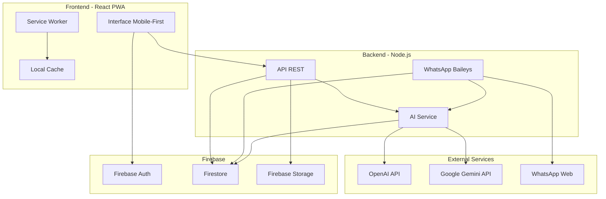

### Fluxo de Dados Multi-Tenant

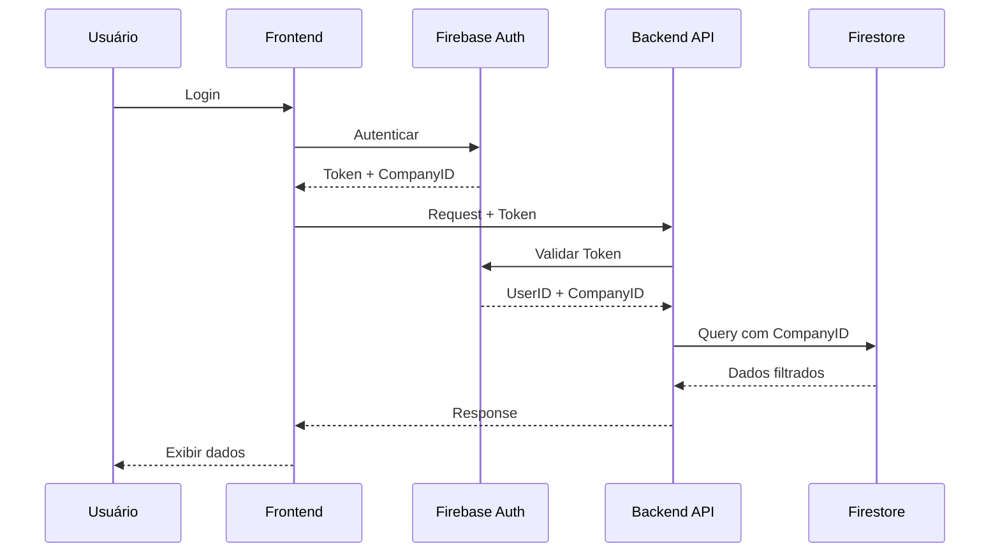

### Arquitetura de Camadas

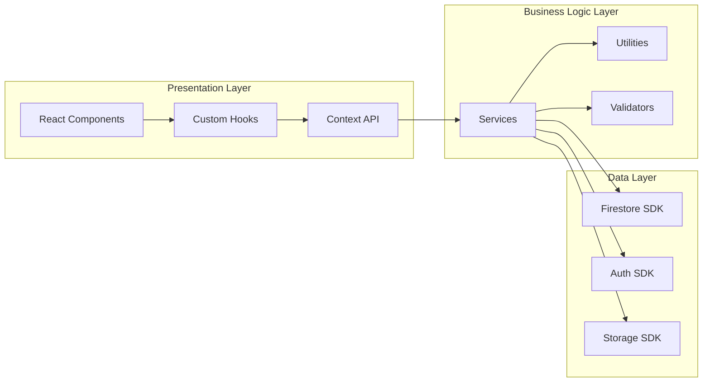

---

## Components and Interfaces

### Estrutura de Pastas Frontend

```
frontend/
├── src/
│   ├── components/
│   │   ├── common/           # Componentes reutilizáveis
│   │   │   ├── Button.tsx
│   │   │   ├── Card.tsx
│   │   │   ├── Sidebar.tsx
│   │   │   └── Modal.tsx
│   │   ├── dashboard/        # Dashboard específico
│   │   │   ├── DashboardCard.tsx
│   │   │   ├── MetricsChart.tsx
│   │   │   └── RecentActivity.tsx
│   │   ├── trabalhos/        # Módulo de trabalhos
│   │   │   ├── TrabalhoForm.tsx
│   │   │   ├── TrabalhoList.tsx
│   │   │   └── TrabalhoDetail.tsx
│   │   ├── agendamentos/     # Módulo de agendamentos
│   │   │   ├── AgendamentoForm.tsx
│   │   │   └── AgendamentoCalendar.tsx
│   │   ├── funcionarios/     # Módulo de funcionários
│   │   │   ├── FuncionarioForm.tsx
│   │   │   ├── FuncionarioList.tsx
│   │   │   └── FuncionarioStats.tsx
│   │   ├── relatorios/       # Módulo de relatórios
│   │   │   ├── RelatorioFilter.tsx
│   │   │   ├── RelatorioTable.tsx
│   │   │   └── RelatorioExport.tsx
│   │   ├── admin/            # Painel admin
│   │   │   ├── EmpresaForm.tsx
│   │   │   ├── EmpresaList.tsx
│   │   │   └── LogsViewer.tsx
│   │   ├── whatsapp/         # Integração WhatsApp
│   │   │   ├── QRCodeDisplay.tsx
│   │   │   ├── MessageList.tsx
│   │   │   └── WhatsAppConfig.tsx
│   │   └── ia/               # Configuração IA
│   │       ├── IAConfig.tsx
│   │       ├── PromptEditor.tsx
│   │       └── UsageStats.tsx
│   ├── contexts/
│   │   ├── AuthContext.tsx
│   │   ├── CompanyContext.tsx
│   │   └── ThemeContext.tsx
│   ├── hooks/
│   │   ├── useAuth.ts
│   │   ├── useFirestore.ts
│   │   ├── useWhatsApp.ts
│   │   └── useIA.ts
│   ├── services/
│   │   ├── api.service.ts
│   │   ├── firestore.service.ts
│   │   ├── auth.service.ts
│   │   └── export.service.ts
│   ├── types/
│   │   ├── user.types.ts
│   │   ├── trabalho.types.ts
│   │   ├── agendamento.types.ts
│   │   └── empresa.types.ts
│   ├── utils/
│   │   ├── validators.ts
│   │   ├── formatters.ts
│   │   └── calculations.ts
│   ├── styles/
│   │   ├── theme.ts
│   │   └── global.css
│   ├── App.tsx
│   └── index.tsx
├── public/
│   ├── manifest.json
│   ├── service-worker.js
│   └── icons/
└── package.json
```

### Estrutura de Pastas Backend

```
backend/
├── src/
│   ├── controllers/
│   │   ├── auth.controller.ts
│   │   ├── trabalho.controller.ts
│   │   ├── agendamento.controller.ts
│   │   ├── funcionario.controller.ts
│   │   ├── relatorio.controller.ts
│   │   ├── empresa.controller.ts
│   │   ├── whatsapp.controller.ts
│   │   └── ia.controller.ts
│   ├── services/
│   │   ├── firestore.service.ts
│   │   ├── whatsapp.service.ts
│   │   ├── ia.service.ts
│   │   ├── openai.service.ts
│   │   ├── gemini.service.ts
│   │   ├── log.service.ts
│   │   └── export.service.ts
│   ├── middleware/
│   │   ├── auth.middleware.ts
│   │   ├── tenant.middleware.ts
│   │   ├── validation.middleware.ts
│   │   └── error.middleware.ts
│   ├── models/
│   │   ├── user.model.ts
│   │   ├── empresa.model.ts
│   │   ├── trabalho.model.ts
│   │   ├── agendamento.model.ts
│   │   ├── funcionario.model.ts
│   │   └── log.model.ts
│   ├── routes/
│   │   ├── auth.routes.ts
│   │   ├── trabalho.routes.ts
│   │   ├── agendamento.routes.ts
│   │   ├── funcionario.routes.ts
│   │   ├── relatorio.routes.ts
│   │   ├── empresa.routes.ts
│   │   ├── whatsapp.routes.ts
│   │   └── ia.routes.ts
│   ├── utils/
│   │   ├── validators.ts
│   │   ├── calculations.ts
│   │   └── formatters.ts
│   ├── config/
│   │   ├── firebase.config.ts
│   │   ├── openai.config.ts
│   │   └── gemini.config.ts
│   ├── types/
│   │   └── index.ts
│   ├── app.ts
│   └── server.ts
├── .env
└── package.json
```

### Interfaces TypeScript Principais

```typescript
// User Types
interface User {
  id: string;
  email: string;
  name: string;
  companyId: string;
  role: 'admin_platform' | 'owner' | 'user';
  permissions: Permission[];
  active: boolean;
  createdAt: Date;
  updatedAt: Date;
  deletedAt: Date | null;  // Soft delete
}

interface Permission {
  module: string;
  actions: ('read' | 'write' | 'delete')[];
}

// Company Types
interface Company {
  id: string;
  name: string;
  planMonths: number;
  planStartDate: Date;
  planEndDate: Date;
  active: boolean;
  config: CompanyConfig;
  createdAt: Date;
  updatedAt: Date;
}

interface CompanyConfig {
  valorCargaPorToneladaCentavos: number;    // SEMPRE em centavos (integer)
  valorDescargaPorToneladaCentavos: number; // SEMPRE em centavos (integer)
  whatsappEnabled: boolean;
  iaEnabled: boolean;
  iaProvider: 'openai' | 'gemini' | null;
  iaModel: string | null;
  iaPrompt: string | null;
  rateLimits: RateLimits;
  fallbackMessages: FallbackMessages;
}

interface RateLimits {
  whatsappMessagesPerDay: number;      // Padrão: 1000
  whatsappMessagesPerMinute: number;   // Padrão: 10
  whatsappCooldownSeconds: number;     // Padrão: 30
  iaRequestsPerMinute: number;         // Padrão: 60
  iaRequestsPerDayPerUser: number;     // Padrão: 500
}

interface FallbackMessages {
  iaFailure: string;
  whatsappDisconnected: string;
  messageNotUnderstood: string;
  rateLimitReached: string;
}

// Trabalho Types
interface Trabalho {
  id: string;
  companyId: string;
  data: Date;
  tipo: 'carga' | 'descarga';
  tonelagem: number;
  valorRecebidoCentavos: number;  // SEMPRE em centavos (integer)
  funcionarios: TrabalhoFuncionario[];
  totalPagoCentavos: number;       // SEMPRE em centavos (integer)
  lucroCentavos: number;           // SEMPRE em centavos (integer)
  observacoes?: string;
  createdBy: string;
  createdAt: Date;
  updatedAt: Date;
  deletedAt: Date | null;          // Soft delete
}

interface TrabalhoFuncionario {
  funcionarioId: string;
  funcionarioNome: string;
  valorPagoCentavos: number;  // SEMPRE em centavos (integer)
}

// Agendamento Types
interface Agendamento {
  id: string;
  companyId: string;
  data: Date;
  tipo: 'carga' | 'descarga';
  tonelagem: number;
  valorEstimadoCentavos: number;  // SEMPRE em centavos (integer)
  funcionarios: string[];
  status: 'pendente' | 'confirmado' | 'cancelado' | 'concluido';
  observacoes?: string;
  createdBy: string;
  createdAt: Date;
  updatedAt: Date;
  deletedAt: Date | null;         // Soft delete
}

// Funcionario Types
interface Funcionario {
  id: string;
  companyId: string;
  nome: string;
  cpf?: string;
  telefone?: string;
  active: boolean;
  createdAt: Date;
  updatedAt: Date;
  deletedAt: Date | null;  // Soft delete
}

// Log Types
interface Log {
  id: string;
  companyId: string | null;
  userId: string | null;
  type: 'access' | 'ia_usage' | 'whatsapp' | 'critical_change';
  action: string;
  details: Record<string, any>;
  timestamp: Date;
}

// IA Usage Types
interface IAUsage {
  id: string;
  companyId: string;
  userId: string;
  provider: 'openai' | 'gemini';
  model: string;
  modelCategory: 'cheap' | 'medium' | 'expensive';
  tokensUsed: number;
  estimatedCostCentavos: number;  // SEMPRE em centavos (integer)
  timestamp: Date;
}

// WhatsApp Types
interface WhatsAppSession {
  id: string;
  companyId: string;
  sessionId: string;
  qrCode: string | null;
  connected: boolean;
  lastActivity: Date;
  createdAt: Date;
}

interface WhatsAppMessage {
  id: string;
  companyId: string;
  sessionId: string;
  from: string;
  to: string;
  message: string;
  type: 'received' | 'sent';
  processedByIA: boolean;
  timestamp: Date;
}
```

---

## Data Models

### Estrutura do Firestore

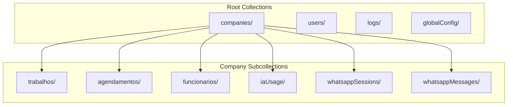

### Coleções e Documentos Firestore

```
firestore/
├── companies/                          # Coleção raiz de empresas
│   └── {companyId}/                    # Documento da empresa
│       ├── name: string
│       ├── planMonths: number
│       ├── planStartDate: timestamp
│       ├── planEndDate: timestamp
│       ├── active: boolean
│       ├── config: map
│       │   ├── valorCargaPorTonelada: number
│       │   ├── valorDescargaPorTonelada: number
│       │   ├── whatsappEnabled: boolean
│       │   ├── iaEnabled: boolean
│       │   ├── iaProvider: string
│       │   ├── iaModel: string
│       │   └── iaPrompt: string
│       ├── createdAt: timestamp
│       └── updatedAt: timestamp
│       │
│       ├── trabalhos/                  # Subcoleção de trabalhos
│       │   └── {trabalhoId}/
│       │       ├── data: timestamp
│       │       ├── tipo: string
│       │       ├── tonelagem: number
│       │       ├── valorRecebido: number
│       │       ├── funcionarios: array
│       │       ├── totalPago: number
│       │       ├── lucro: number
│       │       ├── observacoes: string
│       │       ├── createdBy: string
│       │       ├── createdAt: timestamp
│       │       └── updatedAt: timestamp
│       │
│       ├── agendamentos/               # Subcoleção de agendamentos
│       │   └── {agendamentoId}/
│       │       ├── data: timestamp
│       │       ├── tipo: string
│       │       ├── tonelagem: number
│       │       ├── valorEstimado: number
│       │       ├── funcionarios: array
│       │       ├── status: string
│       │       ├── observacoes: string
│       │       ├── createdBy: string
│       │       ├── createdAt: timestamp
│       │       └── updatedAt: timestamp
│       │
│       ├── funcionarios/               # Subcoleção de funcionários
│       │   └── {funcionarioId}/
│       │       ├── nome: string
│       │       ├── cpf: string
│       │       ├── telefone: string
│       │       ├── active: boolean
│       │       ├── createdAt: timestamp
│       │       └── updatedAt: timestamp
│       │
│       ├── iaUsage/                    # Subcoleção de uso de IA
│       │   └── {usageId}/
│       │       ├── userId: string
│       │       ├── provider: string
│       │       ├── model: string
│       │       ├── modelCategory: string
│       │       ├── tokensUsed: number
│       │       ├── estimatedCost: number
│       │       └── timestamp: timestamp
│       │
│       ├── whatsappSessions/           # Subcoleção de sessões WhatsApp
│       │   └── {sessionId}/
│       │       ├── sessionId: string
│       │       ├── qrCode: string
│       │       ├── connected: boolean
│       │       ├── lastActivity: timestamp
│       │       └── createdAt: timestamp
│       │
│       └── whatsappMessages/           # Subcoleção de mensagens WhatsApp
│           └── {messageId}/
│               ├── sessionId: string
│               ├── from: string
│               ├── to: string
│               ├── message: string
│               ├── type: string
│               ├── processedByIA: boolean
│               └── timestamp: timestamp
│
├── users/                              # Coleção raiz de usuários
│   └── {userId}/                       # Documento do usuário
│       ├── email: string
│       ├── name: string
│       ├── companyId: string
│       ├── role: string
│       ├── permissions: array
│       ├── active: boolean
│       ├── iaConfig: map
│       │   ├── customPrompt: string
│       │   └── blocked: boolean
│       ├── createdAt: timestamp
│       └── updatedAt: timestamp
│
├── logs/                               # Coleção raiz de logs
│   └── {logId}/                        # Documento de log
│       ├── companyId: string
│       ├── userId: string
│       ├── type: string
│       ├── action: string
│       ├── details: map
│       └── timestamp: timestamp
│
└── globalConfig/                       # Coleção de configurações globais
    └── system/                         # Documento de configuração do sistema
        ├── iaGlobalPrompt: string
        ├── iaModels: map
        │   ├── openai: array
        │   └── gemini: array
        └── updatedAt: timestamp
```

### Regras de Segurança Firestore (Conceito)

```javascript
rules_version = '2';
service cloud.firestore {
  match /databases/{database}/documents {
    
    // Helper functions
    function isAuthenticated() {
      return request.auth != null;
    }
    
    function getUserData() {
      return get(/databases/$(database)/documents/users/$(request.auth.uid)).data;
    }
    
    function isAdminPlatform() {
      return isAuthenticated() && getUserData().role == 'admin_platform';
    }
    
    function isOwner() {
      return isAuthenticated() && getUserData().role == 'owner';
    }
    
    function belongsToCompany(companyId) {
      return isAuthenticated() && getUserData().companyId == companyId;
    }
    
    function companyIsActive(companyId) {
      return get(/databases/$(database)/documents/companies/$(companyId)).data.active == true
        && get(/databases/$(database)/documents/companies/$(companyId)).data.planEndDate > request.time;
    }
    
    // Companies collection
    match /companies/{companyId} {
      allow read: if isAdminPlatform() || (belongsToCompany(companyId) && companyIsActive(companyId));
      allow create: if isAdminPlatform();
      allow update: if isAdminPlatform() || (isOwner() && belongsToCompany(companyId) && companyIsActive(companyId));
      allow delete: if isAdminPlatform();
      
      // Subcollections
      match /trabalhos/{trabalhoId} {
        allow read, write: if belongsToCompany(companyId) && companyIsActive(companyId);
      }
      
      match /agendamentos/{agendamentoId} {
        allow read, write: if belongsToCompany(companyId) && companyIsActive(companyId);
      }
      
      match /funcionarios/{funcionarioId} {
        allow read, write: if belongsToCompany(companyId) && companyIsActive(companyId);
      }
      
      match /iaUsage/{usageId} {
        allow read: if isAdminPlatform() || (belongsToCompany(companyId) && companyIsActive(companyId));
        allow write: if belongsToCompany(companyId) && companyIsActive(companyId);
      }
      
      match /whatsappSessions/{sessionId} {
        allow read, write: if belongsToCompany(companyId) && companyIsActive(companyId);
      }
      
      match /whatsappMessages/{messageId} {
        allow read, write: if belongsToCompany(companyId) && companyIsActive(companyId);
      }
    }
    
    // Users collection
    match /users/{userId} {
      allow read: if isAuthenticated() && (isAdminPlatform() || request.auth.uid == userId);
      allow create: if isAdminPlatform() || isOwner();
      allow update: if isAuthenticated() && (isAdminPlatform() || request.auth.uid == userId);
      allow delete: if isAdminPlatform();
    }
    
    // Logs collection
    match /logs/{logId} {
      allow read: if isAdminPlatform() || (isAuthenticated() && resource.data.companyId == getUserData().companyId);
      allow write: if isAuthenticated();
    }
    
    // Global config
    match /globalConfig/{doc} {
      allow read: if isAuthenticated();
      allow write: if isAdminPlatform();
    }
  }
}
```

---

## Correctness Properties

*Uma propriedade é uma característica ou comportamento que deve ser verdadeiro em todas as execuções válidas de um sistema - essencialmente, uma declaração formal sobre o que o sistema deve fazer. As propriedades servem como ponte entre especificações legíveis por humanos e garantias de correção verificáveis por máquina.*

### Propriedades de Isolamento Multi-Tenant

**Property 1: Isolamento completo de dados entre empresas**  
*Para quaisquer* duas empresas diferentes (companyA e companyB), quando um usuário da companyA consulta dados, o sistema não deve retornar nenhum dado da companyB.  
**Validates: Requirements 1.3, 4.5, 5.7, 6.5, 7.8, 11.8, 12.8, 13.1, 13.2**

**Property 2: Bloqueio de acesso para planos vencidos**  
*Para qualquer* empresa com planEndDate anterior à data atual, todas as tentativas de acesso aos dados dessa empresa devem ser bloqueadas.  
**Validates: Requirements 1.4, 13.5**

**Property 3: Identificação de empresa e role no login**  
*Para qualquer* usuário autenticado, o sistema deve retornar companyId e role válidos.  
**Validates: Requirements 1.2**

### Propriedades de Gestão de Empresas

**Property 4: Criação completa de estrutura de empresa**  
*Para qualquer* empresa criada por Admin_Plataforma, todas as subcoleções necessárias (trabalhos, agendamentos, funcionarios, iaUsage, whatsappSessions, whatsappMessages) devem ser acessíveis.  
**Validates: Requirements 2.1**

**Property 5: Alteração de status de empresa**  
*Para qualquer* empresa, o campo active deve poder ser alterado entre true e false por Admin_Plataforma.  
**Validates: Requirements 2.3**

### Propriedades de Gestão de Usuários

**Property 6: Associação correta de usuário à empresa**  
*Para qualquer* usuário criado por Dono_Empresa, o companyId do usuário deve ser igual ao companyId do criador.  
**Validates: Requirements 3.1**

**Property 7: Alteração de status de usuário**  
*Para qualquer* usuário, o campo active deve poder ser alterado entre true e false por Dono_Empresa da mesma empresa.  
**Validates: Requirements 3.3**

**Property 8: Filtragem de usuários por empresa**  
*Para qualquer* Dono_Empresa, a query de usuários deve retornar apenas usuários com o mesmo companyId.  
**Validates: Requirements 3.4**

### Propriedades de Validação de Dados

**Property 9: Validação de tonelagem positiva**  
*Para qualquer* trabalho ou agendamento com tonelagem menor ou igual a zero, a operação de criação deve ser rejeitada.  
**Validates: Requirements 4.3, 5.4**

**Property 10: Validação de valores não-negativos**  
*Para qualquer* trabalho ou agendamento com valor menor que zero, a operação de criação deve ser rejeitada.  
**Validates: Requirements 4.4, 5.5**

**Property 11: Presença de campos obrigatórios em trabalhos**  
*Para qualquer* trabalho criado, os campos data, tipo, tonelagem, valorRecebido e funcionarios devem estar presentes e válidos.  
**Validates: Requirements 5.1**

**Property 12: Presença de campos obrigatórios em agendamentos**  
*Para qualquer* agendamento criado, os campos data, tipo, tonelagem e valor devem estar presentes e válidos.  
**Validates: Requirements 4.1**

### Propriedades de Cálculos Financeiros

**Property 13: Cálculo correto de total pago**  
*Para qualquer* trabalho, o campo totalPago deve ser igual à soma dos valores pagos a todos os funcionários associados.  
**Validates: Requirements 5.2**

**Property 14: Cálculo correto de lucro**  
*Para qualquer* trabalho, o campo lucro deve ser igual a valorRecebido menos totalPago.  
**Validates: Requirements 5.3**

**Property 15: Cálculo correto de faturamento em relatório**  
*Para qualquer* período de relatório, o faturamento total deve ser igual à soma de valorRecebido de todos os trabalhos no período.  
**Validates: Requirements 7.2**

**Property 16: Cálculo correto de custos em relatório**  
*Para qualquer* período de relatório, os custos totais devem ser iguais à soma de totalPago de todos os trabalhos no período.  
**Validates: Requirements 7.3**

**Property 17: Cálculo correto de lucro em relatório**  
*Para qualquer* período de relatório, o lucro total deve ser igual ao faturamento total menos os custos totais.  
**Validates: Requirements 7.4**

### Propriedades de Gestão de Funcionários

**Property 18: Presença de campos obrigatórios em funcionários**  
*Para qualquer* funcionário criado, o campo nome deve estar presente e não vazio.  
**Validates: Requirements 6.1**

**Property 19: Histórico de trabalhos por funcionário**  
*Para qualquer* funcionário, deve ser possível consultar todos os trabalhos onde ele aparece no array de funcionarios.  
**Validates: Requirements 6.2**

**Property 20: Cálculo correto de total recebido por funcionário**  
*Para qualquer* funcionário e período selecionado, o total recebido deve ser igual à soma de todos os valores pagos a ele nos trabalhos do período.  
**Validates: Requirements 6.3**

**Property 21: Contagem correta de trabalhos por funcionário**  
*Para qualquer* funcionário, a contagem de trabalhos deve ser igual ao número de trabalhos onde ele aparece no array de funcionarios.  
**Validates: Requirements 6.4**

### Propriedades de Integração WhatsApp

**Property 22: Armazenamento de mensagens recebidas**  
*Para qualquer* mensagem recebida via WhatsApp, deve existir um documento correspondente na subcoleção whatsappMessages com type='received'.  
**Validates: Requirements 8.3**

**Property 23: Processamento de mensagens com IA ativa**  
*Para qualquer* mensagem recebida quando IA está ativada, o sistema deve processar a mensagem e gerar uma resposta.  
**Validates: Requirements 16.1**

**Property 24: Consulta de dados reais para respostas**  
*Para qualquer* consulta processada pela IA, os dados usados na resposta devem existir no Firestore da empresa.  
**Validates: Requirements 9.3, 16.2**

**Property 25: Envio de resposta via WhatsApp**  
*Para qualquer* resposta gerada pela IA, deve existir uma mensagem correspondente enviada via WhatsApp com type='sent'.  
**Validates: Requirements 16.3**

**Property 26: Prevenção de alucinação da IA**  
*Para qualquer* resposta gerada pela IA, todos os valores numéricos e dados específicos mencionados devem existir no Firestore.  
**Validates: Requirements 9.4, 16.4**

**Property 27: Mensagem padrão em caso de falha**  
*Para qualquer* falha no processamento da IA, o sistema deve enviar uma mensagem padrão predefinida.  
**Validates: Requirements 16.5**

### Propriedades de Uso e Custos de IA

**Property 28: Registro de uso de IA**  
*Para qualquer* requisição processada pela IA, deve ser criado um documento na subcoleção iaUsage com userId, provider, model, tokensUsed e estimatedCost.  
**Validates: Requirements 9.6, 9.7, 16.7**

**Property 29: Cálculo correto de custo de IA**  
*Para qualquer* requisição de IA, o estimatedCost deve ser calculado corretamente baseado no modelo usado e tokens consumidos.  
**Validates: Requirements 10.1**

**Property 30: Acumulação de custos mensais por empresa**  
*Para qualquer* empresa e mês, a soma de estimatedCost de todos os registros em iaUsage deve refletir o custo total mensal.  
**Validates: Requirements 10.2**

**Property 31: Acumulação de custos mensais por usuário**  
*Para qualquer* usuário e mês, a soma de estimatedCost de todos os registros em iaUsage com seu userId deve refletir o custo total mensal.  
**Validates: Requirements 10.3**

**Property 32: Alerta de limite de uso de IA**  
*Para qualquer* empresa com limite de uso configurado, quando o custo acumulado atingir o limite, um alerta deve ser gerado.  
**Validates: Requirements 10.6**

### Propriedades de Logs e Auditoria

**Property 33: Registro de logs de acesso**  
*Para qualquer* acesso de usuário ao sistema, deve ser criado um log com type='access' contendo timestamp, companyId, userId e action.  
**Validates: Requirements 1.6, 12.1**

**Property 34: Registro de logs de alterações de permissões**  
*Para qualquer* alteração no array de permissions de um usuário, deve ser criado um log com type='critical_change'.  
**Validates: Requirements 3.5, 12.4**

**Property 35: Registro de logs de interações WhatsApp**  
*Para qualquer* mensagem enviada ou recebida via WhatsApp, deve ser criado um log com type='whatsapp'.  
**Validates: Requirements 8.6, 12.3**

**Property 36: Registro de logs de uso de IA**  
*Para qualquer* consulta processada pela IA, deve ser criado um log com type='ia_usage' contendo modelo e custo.  
**Validates: Requirements 9.8, 12.2**

**Property 37: Presença de campos obrigatórios em logs**  
*Para qualquer* log criado, os campos timestamp, type e action devem estar presentes.  
**Validates: Requirements 12.5**

**Property 38: Filtragem de logs por empresa para Dono_Empresa**  
*Para qualquer* Dono_Empresa, a query de logs deve retornar apenas logs com o mesmo companyId.  
**Validates: Requirements 12.8**

### Propriedades de Segurança Firestore

**Property 39: Bloqueio de acesso cross-tenant**  
*Para qualquer* usuário tentando acessar dados de uma empresa diferente da sua, a operação deve ser negada pelas Firestore Rules.  
**Validates: Requirements 13.2**

**Property 40: Validação de permissões antes de operações**  
*Para qualquer* operação de leitura ou escrita, as permissões do usuário devem ser verificadas antes de permitir a operação.  
**Validates: Requirements 13.4**

**Property 41: Validação de tipos de dados em escrita**  
*Para qualquer* operação de escrita com tipos de dados inválidos, a operação deve ser rejeitada pelas Firestore Rules.  
**Validates: Requirements 13.6**

### Propriedades de Configuração de Valores

**Property 42: Sugestão de valor baseada em configuração**  
*Para qualquer* trabalho novo, o valor sugerido deve ser igual à configuração (valorCargaPorTonelada ou valorDescargaPorTonelada) multiplicada pela tonelagem.  
**Validates: Requirements 14.3**

**Property 43: Armazenamento de configurações por empresa**  
*Para qualquer* empresa, as configurações valorCargaPorTonelada e valorDescargaPorTonelada devem estar armazenadas em company.config.  
**Validates: Requirements 14.5**

### Propriedades de PWA e Sincronização

**Property 44: Sincronização de dados offline**  
*Para quaisquer* dados modificados enquanto offline, quando a conexão for restaurada, todos os dados pendentes devem ser sincronizados com o Firestore.  
**Validates: Requirements 15.4**

### Propriedades de Serialização

**Property 45: Round-trip de serialização Firestore**  
*Para qualquer* objeto válido do sistema, serializar para JSON e desserializar de volta deve produzir um objeto equivalente.  
**Validates: Requirements 17.1, 17.2**

**Property 46: Validação de estrutura na serialização**  
*Para qualquer* objeto com estrutura inválida, a tentativa de serialização deve falhar com erro descritivo.  
**Validates: Requirements 17.3**

**Property 47: Validação de estrutura na desserialização**  
*Para qualquer* JSON com estrutura inválida, a tentativa de desserialização deve falhar com erro descritivo.  
**Validates: Requirements 17.4**

### Propriedades de Dashboard

**Property 48: Cálculo correto de indicadores do dashboard**  
*Para qualquer* empresa, os indicadores de faturamento, custos, lucro, uso de IA e funcionários devem ser calculados corretamente baseados nos dados do mês atual.  
**Validates: Requirements 11.5**

### Propriedades de Soft Delete

**Property 49: Soft delete preserva registros**  
*Para qualquer* operação de delete de trabalho, funcionário, agendamento ou usuário, o registro deve ser marcado com deletedAt ao invés de ser removido.  
**Validates: Requirements 18.1, 18.2, 18.3, 18.4**

**Property 50: Queries filtram soft-deleted**  
*Para qualquer* query de trabalhos, funcionários, agendamentos ou usuários, registros com deletedAt != null não devem ser retornados.  
**Validates: Requirements 18.5**

**Property 51: Admin pode fazer delete real**  
*Para qualquer* operação de delete real executada por Admin_Plataforma, o registro deve ser permanentemente removido e a ação registrada em logs.  
**Validates: Requirements 18.6, 18.7**

### Propriedades de Valores Monetários

**Property 52: Valores armazenados em centavos**  
*Para qualquer* valor monetário armazenado no Firestore, o valor deve ser um integer representando centavos.  
**Validates: Requirements 19.1**

**Property 53: Conversão reais para centavos**  
*Para qualquer* valor em reais inserido pelo usuário, o sistema deve multiplicar por 100 e armazenar como integer.  
**Validates: Requirements 19.2**

**Property 54: Conversão centavos para reais na UI**  
*Para qualquer* valor exibido na UI, o sistema deve dividir centavos por 100 e formatar como reais.  
**Validates: Requirements 19.3**

**Property 55: Cálculos financeiros em centavos**  
*Para qualquer* cálculo financeiro (totalPago, lucro), o sistema deve usar aritmética de inteiros em centavos.  
**Validates: Requirements 19.5, 19.6, 19.7**

### Propriedades de Rate Limiting

**Property 56: Rate limit WhatsApp por dia**  
*Para qualquer* empresa, o número de mensagens WhatsApp enviadas em um dia não deve exceder o limite configurado (padrão 1000).  
**Validates: Requirements 20.1**

**Property 57: Rate limit WhatsApp por minuto**  
*Para qualquer* número de telefone, o número de mensagens enviadas em um minuto não deve exceder 10.  
**Validates: Requirements 20.2**

**Property 58: Cooldown entre mensagens**  
*Para qualquer* número de telefone, deve haver no mínimo 30 segundos entre mensagens consecutivas.  
**Validates: Requirements 20.3**

**Property 59: Rate limit IA por minuto**  
*Para qualquer* empresa, o número de requisições IA em um minuto não deve exceder 60.  
**Validates: Requirements 20.4**

**Property 60: Rate limit IA por dia por usuário**  
*Para qualquer* usuário, o número de requisições IA em um dia não deve exceder 500.  
**Validates: Requirements 20.5**

**Property 61: Reset de contadores diários**  
*Para qualquer* contador de rate limit diário, o valor deve ser resetado à meia-noite.  
**Validates: Requirements 20.8**

### Propriedades de Fallback Operacional

**Property 62: Fallback quando IA falha**  
*Para qualquer* falha no processamento da IA, o sistema deve enviar mensagem padrão e notificar no painel.  
**Validates: Requirements 21.1, 21.2**

**Property 63: Fallback quando WhatsApp desconecta**  
*Para qualquer* desconexão do WhatsApp, o sistema deve executar desconexão graciosa e alertar no painel.  
**Validates: Requirements 21.3, 21.4**

**Property 64: Fallback para mensagem não compreendida**  
*Para qualquer* mensagem não compreendida pela IA, o sistema deve enviar resposta padrão e registrar em logs.  
**Validates: Requirements 21.5, 21.6**

**Property 65: Retry com backoff exponencial**  
*Para qualquer* falha de serviço externo, o sistema deve tentar novamente com backoff exponencial (máximo 3 tentativas).  
**Validates: Requirements 21.8**

### Propriedades de Resolução de Conflitos

**Property 66: Last-write-wins para conflitos**  
*Para qualquer* conflito de edição offline, o sistema deve usar last-write-wins baseado em timestamp.  
**Validates: Requirements 22.1**

**Property 67: Merge inteligente de arrays**  
*Para qualquer* conflito em arrays, o sistema deve fazer merge inteligente (união de elementos únicos).  
**Validates: Requirements 22.2**

**Property 68: Preservação de versão anterior**  
*Para qualquer* conflito resolvido, o sistema deve preservar versão anterior em logs.  
**Validates: Requirements 22.4**

**Property 69: Sincronização em ordem cronológica**  
*Para qualquer* sincronização offline, os dados pendentes devem ser sincronizados em ordem cronológica.  
**Validates: Requirements 22.6**

---

## Soft Delete Strategy

### Conceito

O sistema implementa **soft delete** para preservar histórico financeiro e permitir auditoria completa. Registros nunca são deletados permanentemente, exceto por Admin_Plataforma.

### Implementação

**Campo deletedAt:**
```typescript
interface SoftDeletable {
  deletedAt: Date | null;  // null = ativo, Date = deletado
}
```

**Entidades com Soft Delete:**
- Trabalhos
- Agendamentos
- Funcionários
- Usuários

**Queries Automáticas:**
```typescript
// Sempre filtrar deletedAt == null
const trabalhos = await firestore
  .collection('companies/{companyId}/trabalhos')
  .where('deletedAt', '==', null)
  .get();
```

### Fluxo de Soft Delete

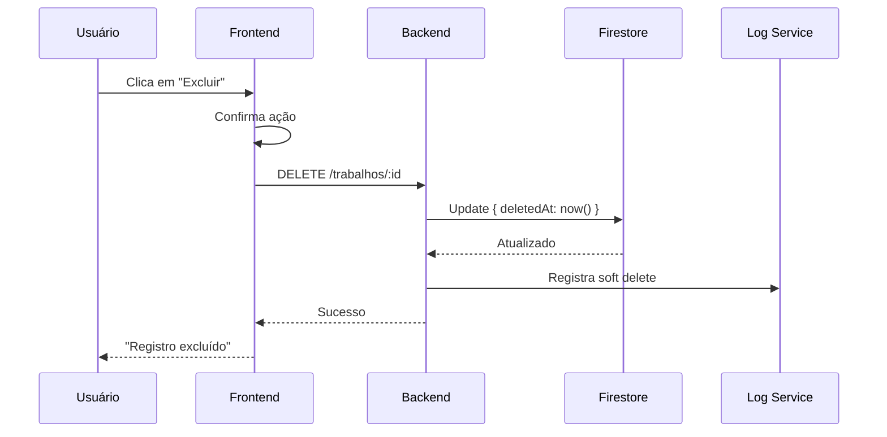

### Restauração

```typescript
// Restaurar registro soft-deleted
async function restore(id: string) {
  await firestore
    .collection('trabalhos')
    .doc(id)
    .update({ deletedAt: null });
  
  await logService.create({
    type: 'critical_change',
    action: 'restore',
    details: { id }
  });
}
```

### Delete Real (Admin apenas)

```typescript
// Delete permanente - apenas Admin_Plataforma
async function hardDelete(id: string, adminId: string) {
  // Verificar se é Admin_Plataforma
  const admin = await getUser(adminId);
  if (admin.role !== 'admin_platform') {
    throw new Error('Unauthorized');
  }
  
  // Registrar antes de deletar
  await logService.create({
    type: 'critical_change',
    action: 'hard_delete',
    details: { id, deletedBy: adminId }
  });
  
  // Delete permanente
  await firestore.collection('trabalhos').doc(id).delete();
}
```

---

## Monetary Values in Cents

### Conceito

Todos os valores monetários são armazenados como **integers em centavos** para prevenir:
- Erros de arredondamento
- Fraudes (ex: R$ 0,01)
- Inconsistências em cálculos

### Implementação

**Armazenamento:**
```typescript
// ❌ ERRADO
interface Trabalho {
  valorRecebido: number;  // float - PERIGOSO!
}

// ✅ CORRETO
interface Trabalho {
  valorRecebidoCentavos: number;  // integer - SEGURO!
}
```

**Conversão:**
```typescript
// Reais → Centavos (ao salvar)
function reaisToCentavos(reais: number): number {
  return Math.round(reais * 100);
}

// Centavos → Reais (ao exibir)
function centavosToReais(centavos: number): number {
  return centavos / 100;
}

// Formatação para UI
function formatCurrency(centavos: number): string {
  const reais = centavosToReais(centavos);
  return new Intl.NumberFormat('pt-BR', {
    style: 'currency',
    currency: 'BRL'
  }).format(reais);
}
```

**Cálculos:**
```typescript
// Todos os cálculos em centavos (integers)
function calcularLucro(trabalho: Trabalho): number {
  const totalPagoCentavos = trabalho.funcionarios.reduce(
    (sum, f) => sum + f.valorPagoCentavos,
    0
  );
  
  return trabalho.valorRecebidoCentavos - totalPagoCentavos;
}
```

### Validação

```typescript
function validateMonetaryValue(centavos: number): boolean {
  // Deve ser integer
  if (!Number.isInteger(centavos)) {
    throw new Error('Valor monetário deve ser integer');
  }
  
  // Deve ser não-negativo
  if (centavos < 0) {
    throw new Error('Valor monetário não pode ser negativo');
  }
  
  return true;
}
```

---

## Rate Limiting Strategy

### Conceito

Controle de uso para prevenir:
- Custos descontrolados de IA
- Spam via WhatsApp
- Abuso de recursos

### Limites Implementados

**WhatsApp:**
- 1000 mensagens/dia por empresa
- 10 mensagens/minuto por número
- 30 segundos de cooldown entre mensagens do mesmo número

**IA:**
- 60 requisições/minuto por empresa
- 500 requisições/dia por usuário

### Implementação

**Estrutura de Dados:**
```typescript
interface RateLimitCounter {
  companyId: string;
  userId?: string;
  phoneNumber?: string;
  type: 'whatsapp_daily' | 'whatsapp_minute' | 'ia_minute' | 'ia_daily';
  count: number;
  windowStart: Date;
  lastRequest: Date;
}
```

**Middleware de Rate Limit:**
```typescript
async function rateLimitMiddleware(req, res, next) {
  const { companyId, userId } = req.auth;
  const type = req.path.includes('/ia/') ? 'ia' : 'whatsapp';
  
  // Verificar limite
  const allowed = await checkRateLimit(companyId, userId, type);
  
  if (!allowed) {
    return res.status(429).json({
      error: 'Rate limit exceeded',
      message: 'Limite de requisições atingido. Tente novamente mais tarde.'
    });
  }
  
  // Incrementar contador
  await incrementRateLimit(companyId, userId, type);
  
  next();
}
```

---

## Operational Fallback Strategy

### Conceito

Garantir continuidade operacional mesmo quando serviços externos falham.

### Cenários de Fallback

**1. IA Falha:**
```typescript
async function processWithIA(message: string, companyId: string) {
  try {
    const response = await iaService.query(message, companyId);
    return response;
  } catch (error) {
    // Log erro
    await logService.create({
      type: 'ia_usage',
      action: 'failure',
      details: { error: error.message }
    });
    
    // Notificar no painel
    await notificationService.create({
      companyId,
      type: 'ia_failure',
      message: 'IA falhou ao processar mensagem'
    });
    
    // Retornar mensagem padrão
    const config = await getCompanyConfig(companyId);
    return config.fallbackMessages.iaFailure;
  }
}
```

**2. WhatsApp Desconecta:**
```typescript
async function handleWhatsAppDisconnect(companyId: string) {
  // Desconexão graciosa
  await whatsappService.gracefulDisconnect(companyId);
  
  // Atualizar status
  await firestore
    .collection(`companies/${companyId}/whatsappSessions`)
    .doc('current')
    .update({ connected: false, disconnectedAt: new Date() });
  
  // Alertar no painel
  await notificationService.create({
    companyId,
    type: 'whatsapp_disconnected',
    message: 'WhatsApp foi desconectado. Reconecte escaneando o QR Code.',
    priority: 'high'
  });
}
```

---

## Offline Conflict Resolution

### Conceito

Resolver conflitos quando múltiplos usuários editam dados offline.

### Estratégia: Last-Write-Wins

```typescript
interface DocumentVersion {
  data: any;
  timestamp: Date;
  userId: string;
  version: number;
}

async function resolveConflict(
  localVersion: DocumentVersion,
  remoteVersion: DocumentVersion
): Promise<DocumentVersion> {
  // Last-write-wins baseado em timestamp
  if (localVersion.timestamp > remoteVersion.timestamp) {
    // Preservar versão anterior em logs
    await logService.create({
      type: 'critical_change',
      action: 'conflict_resolved',
      details: {
        winner: 'local',
        localTimestamp: localVersion.timestamp,
        remoteTimestamp: remoteVersion.timestamp,
        previousVersion: remoteVersion
      }
    });
    
    return localVersion;
  } else {
    return remoteVersion;
  }
}
```

---

## Error Handling

### Estratégia Geral de Tratamento de Erros

O sistema implementa tratamento de erros em múltiplas camadas com logging completo e mensagens descritivas para o usuário.

### Categorias de Erros

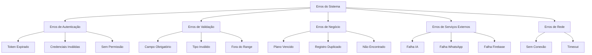

### Códigos de Erro Padronizados

```typescript
enum ErrorCode {
  // Authentication (1xxx)
  AUTH_TOKEN_EXPIRED = 1001,
  AUTH_INVALID_CREDENTIALS = 1002,
  AUTH_INSUFFICIENT_PERMISSIONS = 1003,
  AUTH_USER_INACTIVE = 1004,
  
  // Validation (2xxx)
  VALIDATION_REQUIRED_FIELD = 2001,
  VALIDATION_INVALID_TYPE = 2002,
  VALIDATION_OUT_OF_RANGE = 2003,
  VALIDATION_INVALID_FORMAT = 2004,
  
  // Business Logic (3xxx)
  BUSINESS_PLAN_EXPIRED = 3001,
  BUSINESS_DUPLICATE_RECORD = 3002,
  BUSINESS_NOT_FOUND = 3003,
  BUSINESS_COMPANY_INACTIVE = 3004,
  BUSINESS_IA_BLOCKED = 3005,
  BUSINESS_IA_LIMIT_REACHED = 3006,
  
  // External Services (4xxx)
  EXTERNAL_IA_FAILURE = 4001,
  EXTERNAL_WHATSAPP_FAILURE = 4002,
  EXTERNAL_FIREBASE_FAILURE = 4003,
  EXTERNAL_OPENAI_FAILURE = 4004,
  EXTERNAL_GEMINI_FAILURE = 4005,
  
  // Network (5xxx)
  NETWORK_OFFLINE = 5001,
  NETWORK_TIMEOUT = 5002,
  NETWORK_CONNECTION_FAILED = 5003,
}

interface AppError {
  code: ErrorCode;
  message: string;
  details?: Record<string, any>;
  timestamp: Date;
  userId?: string;
  companyId?: string;
}
```

### Tratamento por Camada

**Frontend:**
- Try-catch em todas as chamadas de API
- Exibição de mensagens amigáveis ao usuário
- Fallback para modo offline quando aplicável
- Retry automático para erros de rede (com backoff exponencial)

**Backend:**
- Middleware de erro global
- Logging de todos os erros em Firestore
- Respostas HTTP padronizadas
- Sanitização de mensagens de erro (não expor detalhes internos)

**Firebase:**
- Tratamento de erros de Firestore Rules
- Retry para operações transacionais
- Fallback para cache local

### Fluxo de Tratamento de Erro

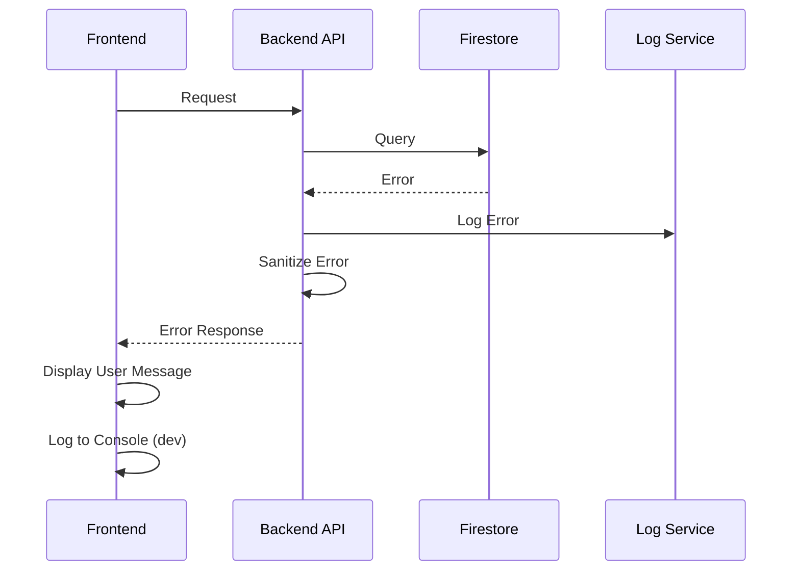

### Mensagens de Erro para Usuário

```typescript
const userMessages: Record<ErrorCode, string> = {
  [ErrorCode.AUTH_TOKEN_EXPIRED]: 'Sua sessão expirou. Por favor, faça login novamente.',
  [ErrorCode.AUTH_INVALID_CREDENTIALS]: 'Email ou senha incorretos.',
  [ErrorCode.AUTH_INSUFFICIENT_PERMISSIONS]: 'Você não tem permissão para realizar esta ação.',
  [ErrorCode.BUSINESS_PLAN_EXPIRED]: 'O plano da sua empresa expirou. Entre em contato com o administrador.',
  [ErrorCode.VALIDATION_REQUIRED_FIELD]: 'Por favor, preencha todos os campos obrigatórios.',
  [ErrorCode.VALIDATION_OUT_OF_RANGE]: 'O valor informado está fora do intervalo permitido.',
  [ErrorCode.EXTERNAL_IA_FAILURE]: 'Não foi possível processar sua solicitação com a IA. Tente novamente.',
  [ErrorCode.EXTERNAL_WHATSAPP_FAILURE]: 'Erro ao conectar com WhatsApp. Verifique a conexão.',
  [ErrorCode.NETWORK_OFFLINE]: 'Você está offline. Algumas funcionalidades podem estar limitadas.',
};
```

### Estratégias de Recuperação

**Erros Recuperáveis:**
- Retry automático com backoff exponencial (máximo 3 tentativas)
- Fallback para cache local
- Queue de operações pendentes para sincronização posterior

**Erros Não-Recuperáveis:**
- Exibir mensagem clara ao usuário
- Registrar em logs para análise
- Oferecer ação alternativa quando possível

---

## Testing Strategy

### Abordagem Dual de Testes

O sistema utiliza uma combinação de **testes unitários** e **testes baseados em propriedades (Property-Based Testing)** para garantir correção abrangente.

**Testes Unitários:**
- Exemplos específicos e casos de borda
- Integração entre componentes
- Condições de erro

**Testes de Propriedade:**
- Propriedades universais que devem valer para todas as entradas
- Cobertura abrangente através de randomização
- Validação de invariantes do sistema

### Bibliotecas de Teste

**Frontend (React/TypeScript):**
- **Jest**: Framework de testes
- **React Testing Library**: Testes de componentes
- **fast-check**: Property-based testing
- **MSW (Mock Service Worker)**: Mock de APIs

**Backend (Node.js/TypeScript):**
- **Jest**: Framework de testes
- **Supertest**: Testes de API
- **fast-check**: Property-based testing
- **Firebase Emulator**: Testes com Firestore local

### Configuração de Testes de Propriedade

Cada teste de propriedade deve:
- Executar **mínimo 100 iterações** (devido à randomização)
- Referenciar a propriedade do documento de design
- Usar tag no formato: **Feature: straxis-saas, Property {número}: {texto da propriedade}**

Exemplo:
```typescript
// Feature: straxis-saas, Property 13: Cálculo correto de total pago
test('totalPago deve ser soma dos valores pagos aos funcionários', () => {
  fc.assert(
    fc.property(
      fc.array(fc.record({
        funcionarioId: fc.string(),
        funcionarioNome: fc.string(),
        valorPago: fc.float({ min: 0, max: 10000 })
      })),
      (funcionarios) => {
        const trabalho = createTrabalho({ funcionarios });
        const expectedTotal = funcionarios.reduce((sum, f) => sum + f.valorPago, 0);
        expect(trabalho.totalPago).toBeCloseTo(expectedTotal, 2);
      }
    ),
    { numRuns: 100 }
  );
});
```

### Cobertura de Testes

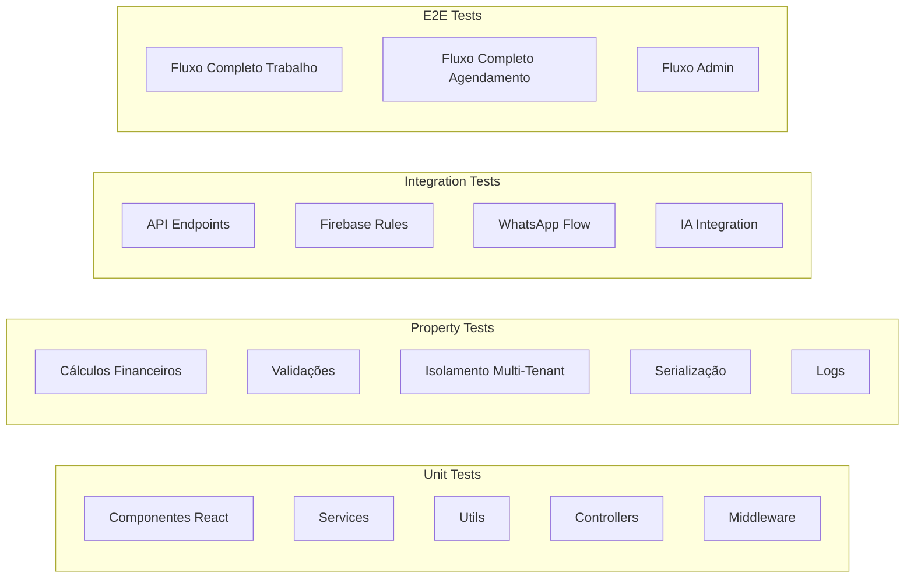

### Mapeamento de Propriedades para Testes

Cada uma das 48 propriedades definidas na seção "Correctness Properties" deve ter:
1. **Um teste de propriedade** implementado com fast-check
2. **Testes unitários complementares** para casos de borda específicos

**Exemplo de Mapeamento:**

| Propriedade | Teste de Propriedade | Testes Unitários Complementares |
|-------------|---------------------|--------------------------------|
| Property 1: Isolamento multi-tenant | Gerar empresas aleatórias e verificar isolamento | Teste específico com 2 empresas conhecidas |
| Property 13: Cálculo de totalPago | Gerar arrays aleatórios de funcionários | Teste com 0 funcionários, 1 funcionário, valores negativos |
| Property 45: Round-trip serialização | Gerar objetos aleatórios e verificar round-trip | Teste com objetos específicos conhecidos |

### Testes de Segurança

**Firestore Rules Testing:**
```typescript
describe('Firestore Security Rules', () => {
  test('usuário não pode acessar dados de outra empresa', async () => {
    const db = initializeTestEnvironment();
    const userA = { uid: 'userA', companyId: 'companyA' };
    const userB = { uid: 'userB', companyId: 'companyB' };
    
    await assertFails(
      db.withAuth(userA).collection('companies/companyB/trabalhos').get()
    );
  });
  
  test('empresa com plano vencido não pode acessar dados', async () => {
    const db = initializeTestEnvironment();
    const expiredCompany = { planEndDate: new Date('2025-01-01') };
    
    await assertFails(
      db.withAuth({ uid: 'user1', companyId: 'expired' })
        .collection('companies/expired/trabalhos').get()
    );
  });
});
```

### Testes de Integração IA

```typescript
describe('IA Integration', () => {
  test('IA não deve inventar dados', async () => {
    const mockFirestore = createMockFirestore({
      trabalhos: [
        { id: '1', valorRecebido: 1000, data: '2026-01-20' }
      ]
    });
    
    const response = await iaService.processQuery(
      'Qual foi o faturamento em janeiro?',
      'companyA'
    );
    
    // Verificar que resposta contém apenas dados reais
    expect(response).toContain('1000');
    expect(response).not.toContain('2000'); // Valor não existente
  });
  
  test('IA deve registrar uso', async () => {
    await iaService.processQuery('teste', 'companyA');
    
    const usage = await getIAUsage('companyA');
    expect(usage).toHaveLength(1);
    expect(usage[0]).toHaveProperty('tokensUsed');
    expect(usage[0]).toHaveProperty('estimatedCost');
  });
});
```

### Testes de WhatsApp

```typescript
describe('WhatsApp Integration', () => {
  test('mensagem recebida deve ser armazenada', async () => {
    const mockMessage = {
      from: '5511999999999',
      message: 'Olá'
    };
    
    await whatsappService.handleIncomingMessage(mockMessage, 'companyA');
    
    const messages = await getWhatsAppMessages('companyA');
    expect(messages).toContainEqual(
      expect.objectContaining({
        from: mockMessage.from,
        message: mockMessage.message,
        type: 'received'
      })
    );
  });
});
```

### Testes de Performance

**Benchmarks críticos:**
- Cálculo de relatórios mensais: < 2 segundos
- Query de trabalhos (100 registros): < 500ms
- Processamento de mensagem IA: < 5 segundos
- Sincronização offline: < 3 segundos

### Estratégia de CI/CD

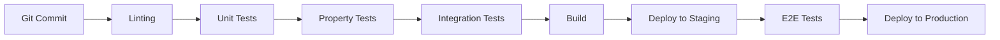

**Pipeline de CI:**
1. Linting (ESLint, Prettier)
2. Testes unitários (cobertura mínima 80%)
3. Testes de propriedade (100 iterações cada)
4. Testes de integração
5. Build
6. Deploy para staging
7. Testes E2E
8. Deploy para produção (manual approval)

---

## Fluxos Principais do Sistema

### Fluxo de Criação de Trabalho

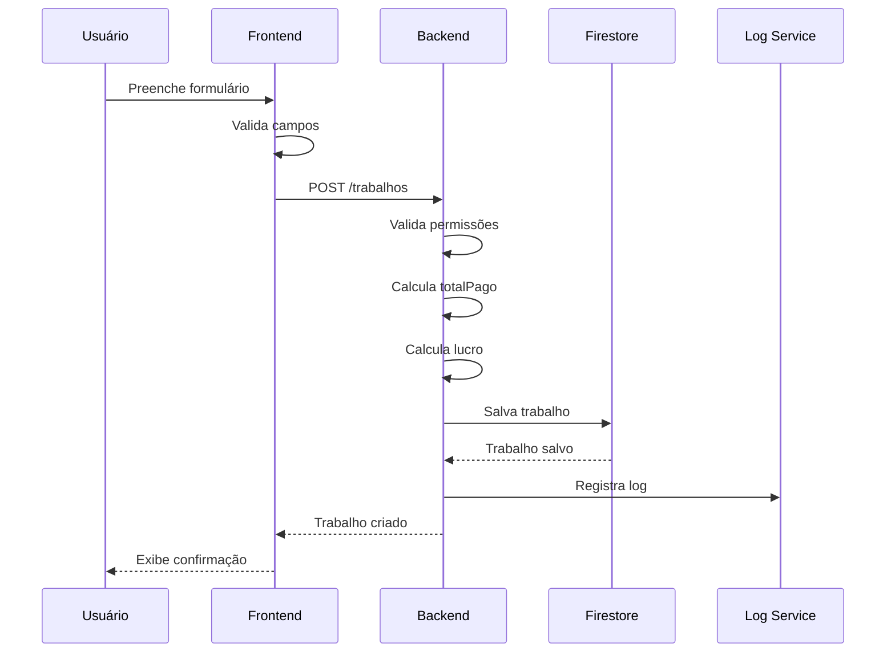

### Fluxo de Integração WhatsApp + IA

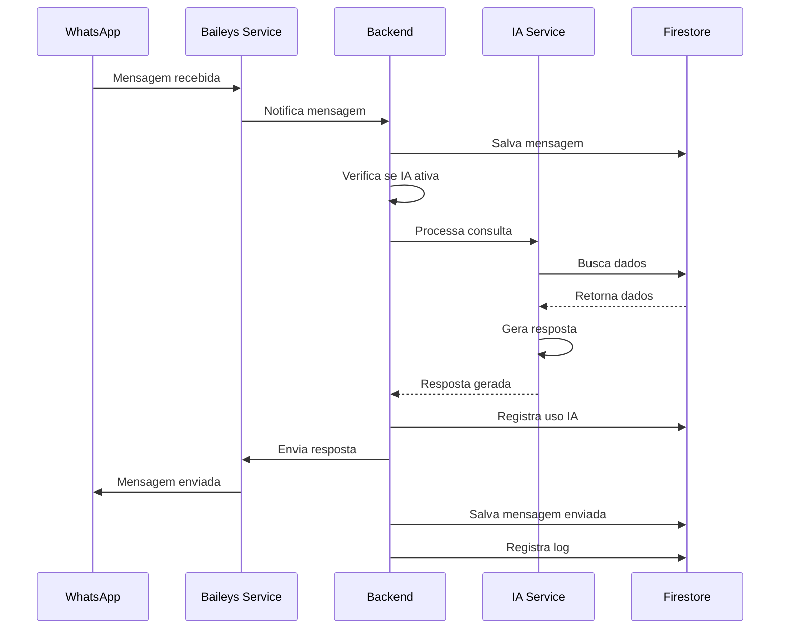

### Fluxo de Geração de Relatório

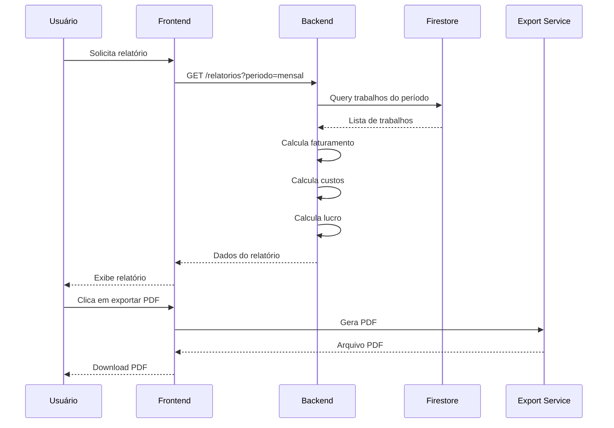

---

## APIs do Backend

### Endpoints Principais

**Autenticação:**
```
POST   /api/auth/login
POST   /api/auth/logout
POST   /api/auth/refresh
GET    /api/auth/me
```

**Empresas (Admin apenas):**
```
GET    /api/empresas
POST   /api/empresas
GET    /api/empresas/:id
PUT    /api/empresas/:id
DELETE /api/empresas/:id
PATCH  /api/empresas/:id/activate
PATCH  /api/empresas/:id/deactivate
```

**Usuários:**
```
GET    /api/usuarios
POST   /api/usuarios
GET    /api/usuarios/:id
PUT    /api/usuarios/:id
DELETE /api/usuarios/:id
PATCH  /api/usuarios/:id/permissions
```

**Trabalhos:**
```
GET    /api/trabalhos
POST   /api/trabalhos
GET    /api/trabalhos/:id
PUT    /api/trabalhos/:id
DELETE /api/trabalhos/:id
GET    /api/trabalhos/stats
```

**Agendamentos:**
```
GET    /api/agendamentos
POST   /api/agendamentos
GET    /api/agendamentos/:id
PUT    /api/agendamentos/:id
DELETE /api/agendamentos/:id
PATCH  /api/agendamentos/:id/status
```

**Funcionários:**
```
GET    /api/funcionarios
POST   /api/funcionarios
GET    /api/funcionarios/:id
PUT    /api/funcionarios/:id
DELETE /api/funcionarios/:id
GET    /api/funcionarios/:id/stats
```

**Relatórios:**
```
GET    /api/relatorios/diario
GET    /api/relatorios/semanal
GET    /api/relatorios/mensal
GET    /api/relatorios/funcionario/:id
POST   /api/relatorios/export/pdf
POST   /api/relatorios/export/excel
```

**WhatsApp:**
```
POST   /api/whatsapp/connect
GET    /api/whatsapp/qrcode
GET    /api/whatsapp/status
POST   /api/whatsapp/disconnect
GET    /api/whatsapp/messages
POST   /api/whatsapp/send
```

**IA:**
```
POST   /api/ia/query
GET    /api/ia/usage
GET    /api/ia/usage/company/:id
GET    /api/ia/usage/user/:id
PUT    /api/ia/config
PUT    /api/ia/prompt
```

**Logs:**
```
GET    /api/logs
GET    /api/logs/company/:id
GET    /api/logs/user/:id
GET    /api/logs/type/:type
```

---

## Considerações para Escalabilidade

### Otimizações de Performance

**Firestore:**
- Índices compostos para queries frequentes
- Paginação em todas as listagens (limite de 50 itens por página)
- Cache de dados frequentemente acessados
- Batch writes para operações em lote

**Frontend:**
- Code splitting por rota
- Lazy loading de componentes
- Virtualização de listas longas
- Debounce em campos de busca
- Memoização de cálculos pesados

**Backend:**
- Rate limiting por usuário e por empresa
- Caching de respostas com Redis (futuro)
- Connection pooling
- Compressão de respostas (gzip)

### Limites e Quotas

**Por Empresa:**
- Máximo 1000 trabalhos por mês (soft limit)
- Máximo 500 funcionários ativos
- Máximo 100 usuários
- Máximo 10.000 mensagens WhatsApp por mês

**IA:**
- Limite configurável de custo mensal por empresa
- Rate limit: 60 requisições por minuto por empresa
- Timeout: 30 segundos por requisição

**Firestore:**
- Respeitar limites do Firebase (1 write/second por documento)
- Batch writes limitados a 500 operações
- Queries limitadas a 100 documentos por vez

### Monitoramento

**Métricas Críticas:**
- Tempo de resposta de APIs (p50, p95, p99)
- Taxa de erro por endpoint
- Uso de IA por empresa
- Custo de IA por empresa
- Número de usuários ativos
- Número de trabalhos criados por dia
- Taxa de sucesso de sincronização offline

**Alertas:**
- Tempo de resposta > 2 segundos
- Taxa de erro > 5%
- Custo de IA > limite configurado
- Plano de empresa próximo ao vencimento (7 dias)
- Falha na conexão WhatsApp

---

## Riscos e Pontos de Atenção

### Riscos Técnicos

**Alto Risco:**
1. **Alucinação da IA**: IA pode inventar dados não existentes
   - Mitigação: Validação rigorosa de respostas, apenas consultar Firestore
   
2. **Custos de IA descontrolados**: Uso excessivo pode gerar custos altos
   - Mitigação: Limites por empresa, alertas, categorização de modelos

3. **Instabilidade do WhatsApp**: Baileys pode quebrar com atualizações do WhatsApp
   - Mitigação: Monitoramento constante, fallback para desconexão graciosa

**Médio Risco:**
4. **Isolamento multi-tenant**: Vazamento de dados entre empresas
   - Mitigação: Firestore Rules rigorosas, testes de segurança

5. **Sincronização offline**: Conflitos de dados
   - Mitigação: Timestamps, last-write-wins, queue de operações

6. **Performance com grande volume**: Lentidão com muitos dados
   - Mitigação: Paginação, índices, cache

### Riscos de Negócio

1. **Dependência de serviços externos**: Firebase, OpenAI, Gemini
   - Mitigação: Fallbacks, múltiplos providers

2. **Complexidade para usuários**: Sistema pode ser complexo demais
   - Mitigação: Onboarding, tutoriais, UX simplificada

3. **Custo operacional**: Firebase e IA podem ficar caros
   - Mitigação: Monitoramento de custos, otimizações

### Pontos de Atenção

**Segurança:**
- Validar TODAS as entradas do usuário
- Sanitizar dados antes de exibir
- Implementar rate limiting
- Logs de auditoria completos
- Backup regular do Firestore

**Compliance:**
- LGPD: Consentimento para uso de dados
- Retenção de dados: Política de exclusão
- Exportação de dados: Permitir que usuário exporte seus dados

**Manutenção:**
- Documentação atualizada
- Testes automatizados
- Monitoramento proativo
- Plano de disaster recovery

---

## Próximos Passos

Após aprovação deste design, os próximos passos são:

1. **Criar tasks.md**: Plano de implementação detalhado
2. **Setup do projeto**: Estrutura de pastas, dependências
3. **Implementação incremental**: Seguir tasks em ordem
4. **Testes contínuos**: Escrever testes junto com código
5. **Deploy staging**: Ambiente de testes
6. **Testes E2E**: Validação completa
7. **Deploy produção**: Lançamento

---

**Documento criado em:** 26/01/2026  
**Última atualização:** 26/01/2026  
**Versão:** 1.0
