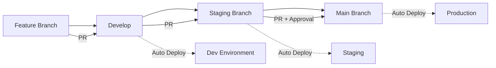

# CI/CD Pipeline - Straxis SaaS

## Visão Geral

O pipeline CI/CD do Straxis é implementado usando GitHub Actions e Firebase. Ele automatiza testes, builds e deploys para ambientes de staging e produção.

## Ambientes

### 1. Development (Local)
- **URL**: http://localhost:5173
- **Backend**: http://localhost:3000
- **Firebase**: Emuladores locais
- **Uso**: Desenvolvimento local

### 2. Staging
- **URL**: https://staging.straxis.app
- **Firebase Project**: straxis-staging
- **Branch**: `staging`
- **Deploy**: Automático via GitHub Actions
- **Uso**: Testes E2E e validação antes de produção

### 3. Production
- **URL**: https://app.straxis.app
- **Firebase Project**: straxis-production
- **Branch**: `main`
- **Deploy**: Automático via GitHub Actions (requer aprovação)
- **Uso**: Ambiente de produção

## Workflows

### 1. CI/CD Pipeline (`ci-cd.yml`)

**Triggers:**
- Push para `main`, `develop`, `staging`
- Pull requests para `main`, `develop`

**Jobs:**

1. **Lint** - Validação de código
   - ESLint (backend e frontend)
   - Prettier check
   
2. **Test Backend** - Testes do backend
   - Testes unitários
   - Cobertura de código
   - Upload para Codecov
   
3. **Test Frontend** - Testes do frontend
   - Testes unitários
   - Cobertura de código
   - Upload para Codecov
   
4. **Build Backend** - Build do backend
   - Compilação TypeScript
   - Geração de artifacts
   
5. **Build Frontend** - Build do frontend
   - Build Vite
   - Geração de artifacts
   
6. **Deploy Staging** - Deploy para staging
   - Apenas branch `staging`
   - Firestore Rules e Indexes
   - Frontend (Firebase Hosting)
   - Backend (Cloud Run/similar)
   
7. **Deploy Production** - Deploy para produção
   - Apenas branch `main`
   - Requer aprovação manual
   - Firestore Rules e Indexes
   - Frontend (Firebase Hosting)
   - Backend (Cloud Run/similar)
   - Criação de tag de release
   
8. **Notify** - Notificações
   - Slack/Discord/Email

### 2. Security Scan (`security-scan.yml`)

**Triggers:**
- Schedule: Toda segunda-feira às 9h
- Push para `main`, `develop`
- Pull requests para `main`

**Jobs:**

1. **Dependency Scan** - Scan de dependências
   - npm audit
   - Snyk Security Scan
   
2. **Code Scan** - Scan de código
   - CodeQL Analysis
   
3. **Secret Scan** - Scan de secrets
   - TruffleHog

## Secrets Necessários

Configure os seguintes secrets no GitHub:

### Firebase
```
FIREBASE_TOKEN - Token de autenticação do Firebase CLI
```

### Frontend (Vite)
```
VITE_FIREBASE_API_KEY
VITE_FIREBASE_AUTH_DOMAIN
VITE_FIREBASE_PROJECT_ID
VITE_FIREBASE_STORAGE_BUCKET
VITE_FIREBASE_MESSAGING_SENDER_ID
VITE_FIREBASE_APP_ID
VITE_API_URL
```

### Backend
```
FIREBASE_PROJECT_ID
FIREBASE_CLIENT_EMAIL
FIREBASE_PRIVATE_KEY
OPENAI_API_KEY (opcional)
GEMINI_API_KEY (opcional)
```

### Segurança
```
SNYK_TOKEN - Token do Snyk (opcional)
```

### Notificações (opcional)
```
SLACK_WEBHOOK_URL
DISCORD_WEBHOOK_URL
```

## Como Configurar Secrets

### 1. GitHub Secrets

```bash
# No repositório GitHub:
Settings > Secrets and variables > Actions > New repository secret
```

### 2. Firebase Token

```bash
# Gerar token do Firebase
firebase login:ci

# Copiar o token gerado e adicionar como secret FIREBASE_TOKEN
```

### 3. Firebase Config

```bash
# Obter configuração do Firebase
firebase apps:sdkconfig web

# Adicionar cada valor como secret (VITE_FIREBASE_*)
```

## Scripts de Deploy Manual

### Deploy para Staging

```bash
# Dar permissão de execução
chmod +x scripts/deploy-staging.sh

# Executar deploy
./scripts/deploy-staging.sh
```

### Deploy para Produção

```bash
# Dar permissão de execução
chmod +x scripts/deploy-production.sh

# Executar deploy (requer confirmação)
./scripts/deploy-production.sh
```

## Fluxo de Trabalho

### Feature Development



### Processo de Release

1. **Desenvolvimento**
   ```bash
   git checkout -b feature/nova-funcionalidade
   # Desenvolver feature
   git commit -m "feat: nova funcionalidade"
   git push origin feature/nova-funcionalidade
   ```

2. **Pull Request para Develop**
   - Criar PR para `develop`
   - CI executa testes e lint
   - Code review
   - Merge após aprovação

3. **Deploy para Staging**
   ```bash
   git checkout staging
   git merge develop
   git push origin staging
   # CI faz deploy automático para staging
   ```

4. **Testes em Staging**
   - Executar testes E2E
   - Validação manual
   - Smoke tests

5. **Deploy para Produção**
   ```bash
   git checkout main
   git merge staging
   git push origin main
   # CI faz deploy automático para produção (após aprovação)
   ```

## Rollback

### Rollback de Frontend (Firebase Hosting)

```bash
# Listar versões anteriores
firebase hosting:releases:list --project production

# Fazer rollback para versão específica
firebase hosting:rollback --project production
```

### Rollback de Backend

```bash
# Depende do provedor de cloud
# Exemplo para Cloud Run:
gcloud run services update-traffic straxis-backend \
  --to-revisions=PREVIOUS_REVISION=100 \
  --project production
```

### Rollback de Firestore Rules

```bash
# Restaurar rules de commit anterior
git checkout HEAD~1 firestore.rules
firebase deploy --only firestore:rules --project production
```

## Monitoramento

### Logs

**Frontend (Firebase Hosting):**
```bash
firebase hosting:logs --project production
```

**Backend:**
```bash
# Depende do provedor
# Exemplo para Cloud Run:
gcloud logging read "resource.type=cloud_run_revision" \
  --project production \
  --limit 50
```

### Métricas

- **Uptime**: Firebase Hosting (99.95% SLA)
- **Performance**: Firebase Performance Monitoring
- **Errors**: Firebase Crashlytics
- **Analytics**: Firebase Analytics

### Alertas

Configure alertas para:
- Deploy failures
- Test failures
- Security vulnerabilities
- Performance degradation
- Error rate spikes

## Troubleshooting

### Deploy Falha

1. Verificar logs do GitHub Actions
2. Verificar secrets configurados
3. Verificar permissões do Firebase
4. Verificar quota do Firebase

### Testes Falham

1. Executar testes localmente
2. Verificar dependências atualizadas
3. Verificar Firebase Emulators
4. Verificar variáveis de ambiente

### Build Falha

1. Verificar erros de TypeScript
2. Verificar dependências
3. Verificar configuração do build
4. Limpar cache: `npm ci`

## Melhores Práticas

### Commits

- Use Conventional Commits
- Mensagens descritivas
- Commits atômicos

### Branches

- `main` - Produção (protegida)
- `staging` - Staging (protegida)
- `develop` - Desenvolvimento
- `feature/*` - Features
- `fix/*` - Bug fixes
- `hotfix/*` - Hotfixes urgentes

### Pull Requests

- Descrição clara
- Testes passando
- Code review obrigatório
- Squash commits ao mergear

### Testes

- Mínimo 80% de cobertura
- Testes unitários e de integração
- Property-based tests para lógica crítica
- E2E tests antes de produção

### Segurança

- Nunca commitar secrets
- Usar .env.example como template
- Scan de segurança semanal
- Atualizar dependências regularmente

## Recursos

- [GitHub Actions Docs](https://docs.github.com/en/actions)
- [Firebase CLI Docs](https://firebase.google.com/docs/cli)
- [Firebase Hosting Docs](https://firebase.google.com/docs/hosting)
- [Conventional Commits](https://www.conventionalcommits.org/)
